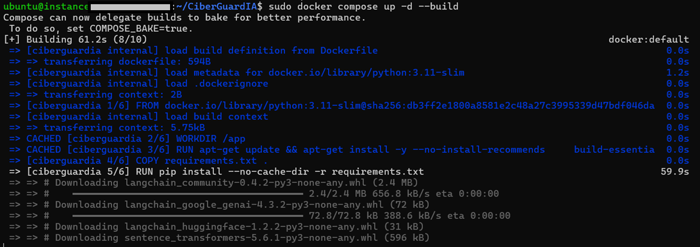
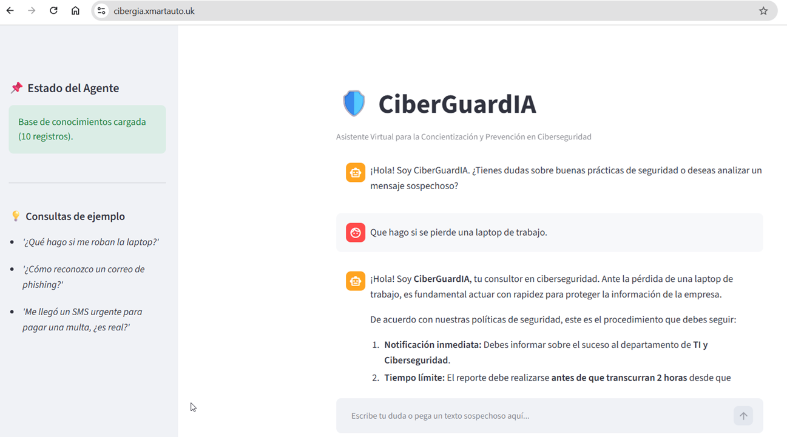

# 🛡️ CiberGuardIA - Agente de Concientización en Ciberseguridad (RAG)

Asistente virtual interactivo basado en una arquitectura RAG (\*Retrieval-Augmented Generation\*) diseñado para educar a usuarios y empleados sobre buenas prácticas de ciberseguridad, prevención de phishing, manejo de credenciales y cumplimiento de políticas internas.

## 📋 Descripción General


**CiberGuardIA** procesa múltiples bases de conocimiento en formato CSV (guías de phishing, políticas de seguridad organizacional, higiene de credenciales y respuesta a ingeniería social). Utiliza búsqueda semántica vectorial para extraer el contexto relevante y generar respuestas pedagógicas y defensivas con el modelo Google Gemini.


### Características Principales:

\*\*\*Lectura Multifuente:\*\* Ingesta y estructuración automática de políticas y guías de seguridad desde archivos CSV.

\*\*\*Embeddings Locales Gratuitos:\*\* Conversión de documentos a vectores semánticos mediante `sentence-transformers/all-MiniLM-L6-v2` ejecutado 100% de forma local.

\*\*\*Base Vectorial Ligera:\*\* Indexación y recuperación en memoria mediante \*\*FAISS\*\*.

\*\*\*Doble Interfaz:\*\* Disponible tanto para consola (CLI) como para interfaz web interactiva con \*\*Streamlit\*\*.

\*\*\*System Prompt Defensivo:\*\* Configurado con directivas estrictas para evitar la generación de código malicioso o explicaciones de ciberataques ofensivos.


## 🏗️ Arquitectura de la Solución
```bash
[ Archivos CSV de Seguridad ] ──> [ Chunking (LangChain) ] ──> [ Embeddings Locales (MiniLM) ]
                                                                                │
[ Usuario (Web / CLI) ] ──────────> [ Consulta ] ──────────────> [ Base Vectorial (FAISS) ]
                                                                                │                                                                              
                                                                     Contexto Relevante (k=3)                                                                     
                                                                                │                                                                                
[ Respuesta Defensiva ] <── [ Gemini 2.0 Flash LLM ] <────────── [ System Prompt + Contexto ]
```

1. **Ingesta y Procesamiento:** Los datos de seguridad en `data/\\\*.csv` se leen con Pandas y se transforman en objetos `Document` de LangChain.
2. **Indexación:** Los documentos se dividen con `RecursiveCharacterTextSplitter` e indexan en FAISS.
3. **Recuperación Semántica:** Ante una consulta (o muestra de correo sospechoso), el recuperador extrae las 3 evidencias documentales más cercanas.
4. **Generación Educativa:** `gemini-2.0-flash` analiza la consulta combinada con el contexto para ofrecer diagnósticos de riesgo y recomendaciones.


## 🛠️ Tecnologías Utilizadas


\*\*\*Lenguaje:\*\* Python 3.10+

\*\*\*Framework RAG:\*\* LangChain (`langchain-core`, `langchain-community`, `langchain-google-genai`, `langchain-huggingface`)

\*\*\*Modelo de Lenguaje (LLM):\*\* Google Gemini (`gemini-2.0-flash`)

\*\*\*Modelo de Embeddings:\*\* Hugging Face (`sentence-transformers/all-MiniLM-L6-v2`) — \*Ejecución Local\*

\*\*\*Base de Datos Vectorial:\*\* FAISS (`faiss-cpu`)

\*\*\*Interfaz Gráfica:\*\* Streamlit

\*\*\*Procesamiento de Datos:\*\* Pandas

## 🚀 Instalación y Configuración

---
### 1. Clonar el repositorio

```bash
git clone \\\[https://github.com/lorgiolazarte/CiberGuardIA.git](https://github.com/lorgiolazarte/CiberGuardIA.git)
cd CiberGuardIA
```

---
### 2. Crear y activar el entorno virtual

```bash

\\# Linux / macOS

python3 -m venv .venv

source .venv/bin/activate


\\# Windows (PowerShell)

python -m venv .venv

.\\\\.venv\\\\Scripts\\\\Activate.ps1

```

---
### 3. Instalar dependencias

```bash

pip install -r requirements.txt

```
---
### 4. Configurar la clave de API

Crea un archivo `.env` en la raíz del proyecto:

```env

GEMINI\\\_API\\\_KEY="TU API KEY"

```

## 💻 Modos de Ejecución

\### Opción A: Interfaz Web (Streamlit)

```bash

streamlit run streamlit\\\_app.py

```


\### Opción B: Interfaz de Consola (CLI)

```bash

python app.py

```


\---
## 💻 Modos de Contenedor con Docker

```bash

git clone https://github.com/lorgiolazarte/CiberGuardIA.git
vi .env
sudo docker compose up -d

```

### 5.💡 Ejemplos de Uso

**CiberGuardIA** está diseñado para responder consultas sobre concientización en ciberseguridad utilizando un sistema RAG (*Retrieval-Augmented Generation*). Puede responder a preguntas sobre políticas internas, detección de fraudes y buenas prácticas.

---

### 🌐 Interfaz Web (Streamlit)

1. Abre la aplicación en tu navegador (ej. `http://tu-ip-servidor:8501`).
2. En la barra lateral o en el chat principal, escribe tu consulta.
3. El agente buscará en la base de conocimientos (*FAISS vector database*) y generará una respuesta contextualizada con **Gemini 2.0 Flash**.

#### Ejemplos de preguntas que puedes hacerle:

* **Identificación de Phishing:**
  > *"Recibí un correo que dice ser de mi banco pidiéndome verificar mi cuenta con urgencia, ¿cómo sé si es falso?"*

* **Gestión de Credenciales:**
  > *"¿Cuáles son las reglas de la empresa para crear una contraseña segura y con qué frecuencia debo cambiarla?"*

* **Ingeniería Social y Móviles:**
  > *"Me escribieron por WhatsApp ofreciéndome un trabajo fácil a cambio de dar mis datos personales, ¿qué debo hacer?"*

* **Políticas Organizacionales:**
  > *"¿Puedo conectar mi dispositivo USB personal a la computadora del trabajo para copiar unos archivos?"*

---


### 6. 📸 Evidencias de Funcionamiento


\*(Capturas Funcionamiento APP WEB)\*


\*(Capturas Funcionamiento Consola)\*


\*(Instalando contenedor en la nube)\*


\*(Accediendo a la consola web desde la Nube de Oracle)\
https://cibergia.xmartauto.uk/  (Acceso Temporal)*

